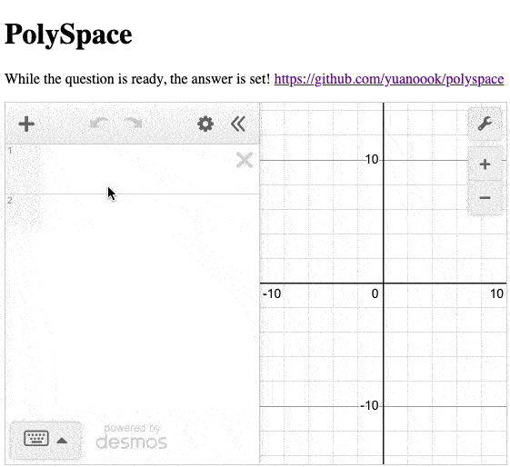

[](https://yuanoook.github.io/polyspace/)

# Interactive Demo
https://observablehq.com/@yuanoook/polyspace-randomnet

```bash
npm install polyspace
```

## Everything is already set.

Motion in lower dimensional space,

is static in higher dimensional space.


When the question is ready,

the answers are set.


Answers are set,

in multiple dimensional space.


Like the stars in the sky,

they are shining,

waiting to be found.


# 1 Multiple dimensional continuous space

It's a singleton


The challenge is

travel in Multiple dimensional continuous space,

and find the stars / answers effectively.


# 2 Point in space

A point is a polynomial,

it's an identified position in space.

# 3 Origin point

Dimensions    Instance

0             []

1             [0] 

2             [0, 0] 

3             [0, 0, 0] 

4             [0, 0, 0, 0] 

5             [0, 0, 0, 0, 0]

...

n             [0(1), 0(2), 0(3), 0(4), 0(5), ...0(n)] 

# 4 Network

Network is a group of linked points

# 5 Linked point

A linked point is a point,

it's accessible from Origin by certain paths.


A linked point is connected with it's adjacent neighbors.

# 6 Adjacent points

From any 1 dimension view,

a linked point can only have two adjacent neighbors at most.


From global view,

2 adjacent points can only have difference in 1 dimension

# 7 Sides

From any 1 dimension view,

a linked point has 2 sides.

# 8 Left(-) side adjacent point

From any 1 dimension view,

Left(-) adjacent point is smaller than the point numerically.

# 9 Right(+) side adjacent point

From any 1 dimension view,

Right(+) adjacent point is bigger than the point numerically.


# 10 Linked point examples

[
  (val1, left1-, right1+),

  (val2, left2-, right2+),

  (val3, left3-, right3+)

  ...

]


[](https://gitpod.io/#https://github.com/yuanoook/polyspace)


